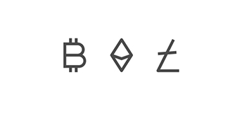
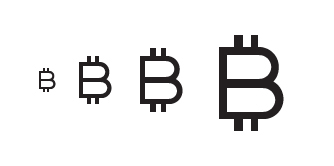
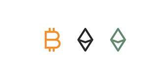
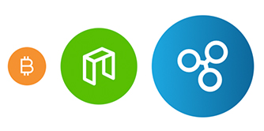

# coinicon
#### v1.0 | 64 cryptocurrency icons

___


coinicon is a simplified version of cryptocurrency logo and icon. All of these icons are my personal reinterpretation of the actual logo without changing any essential part of the visual, and keeping the icon identifiable as it is.

coinicon is made by Rizal Renaldi a.k.a HelloSignal.

#### Terms & Disclaimer

- Use these icons only to represent it's actual cryptocurrency
- No copyright infringement intended on all of these icon

___


## [Preview](https://www.signalsuply.co/coinicon)

___

## Usage

coinicon is a font-based icon with pre-configured setting via css.

- Download the package
- Copy `coinicon` fonts folder
- Insert css to your html
```html  
<link rel="stylesheet" href="coinicon.css">
```

See list of all currencies name and codes (v1.0) here.

___

### Icons

Existing version (1.0) contains 64 cryptocurrency icons based on actual market cap top rank from [coinmarketcap.com](https://coinmarketcap.com) in early November 2017.

Use each currency's actual code with the ci- prefix.



```html
<i class="ci ci-btc"></i>
<i class="ci ci-eth"></i>  
<i class="ci ci-ltc"></i>
```
___

### Sizes

coinicon's based size is 48px. Shrink it down using suffix `-s`, and make it larger using `-m` and `-l`. Create your own set of sizes by overriding this suffix.



```html
<i class="ci-s ci-btc"></i> // 24px
<i class="ci ci-btc"></i> // 48px default
<i class="ci-m ci-btc"></i> // 64px  
<i class="ci-l ci-btc"></i> // 96px  
```

___

### Colors

Pre-configured color is set for each icon. So far, only NAVcoin and Ripple that has gradient color.



```html
<i class="ci ci-btc btc-color"></i>
<i class="ci ci-eth eth-color"></i>
<i class="ci ci-eth etc-color"></i>
```

Special treatment on Ethreum and Ethereum Classic. Since both share same icon, use `.ci-etc` for both icon, and use `.eth-color` for Ethereum's color and `.etc-color` for Ethereum Classic's color.

___

### Round Frame

Round frame variation using the same color with colored icon. Easily combine it with size suffix.



```html
<i class="ci-s ci-btc btc-round"></i>
<i class="ci ci-neo neo-round"></i>
<i class="ci-m ci-xrp xrp-round"></i>  
```

Special treatment on Ethreum and Ethreum Classic. Since both share same icon, use .ci-etc for both icon, and use .eth-round for Ethereum's round color and .etc-round for Ethereum Classic's round color.

___

### License

coinicon is open source and free to use for personal and commercial project.

coinicon font license under [SIL 1.1](http://scripts.sil.org/cms/scripts/page.php?site_id=nrsi&id=OFL)  
coinicon code license under [MIT](http://opensource.org/licenses/mit-license.php)

___

### Donation

coinicon is free to use for personal or commercial project but I'd be happy to receive some coins to buy myself drinks while I'm continue making more coinicons :)

BTC: 15d68vQ9sTogP2182hmosR4g5vSQK5Fa6F

ETH: 0x4713aFAbC1A5cDFB8838c89224d9429FF1F2bA5d

___

coinicon by Rizal Renaldi a.k.a HelloSignal | [SignalSupply](http://www.signasupply.co) | [Github](https://github.com/rizalrenaldi/coinicon)
